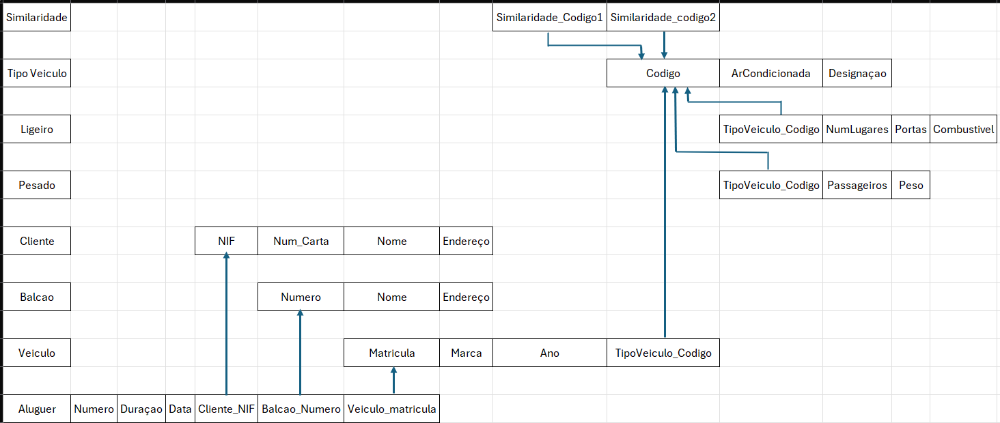
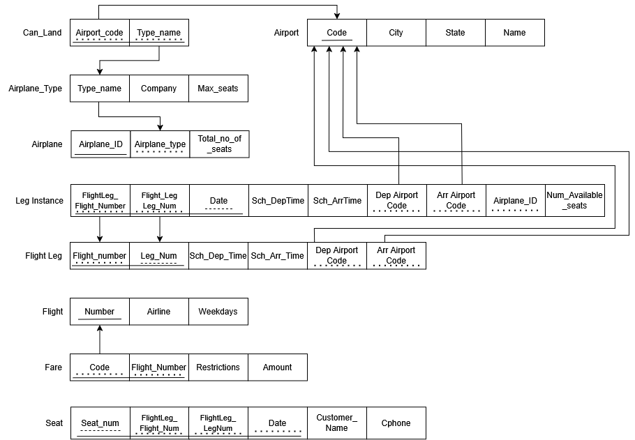
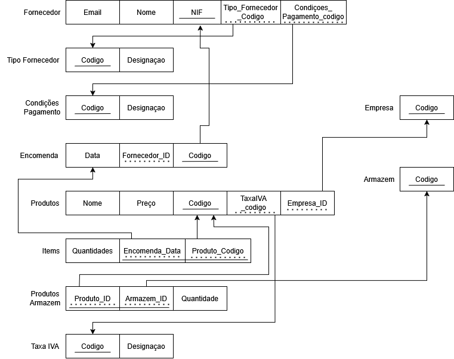
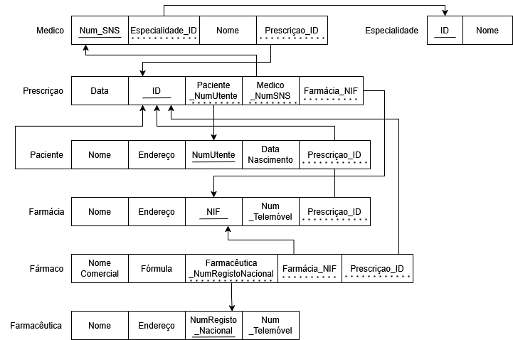
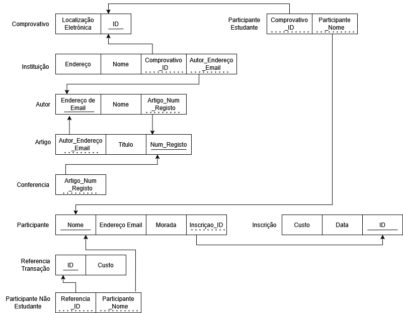
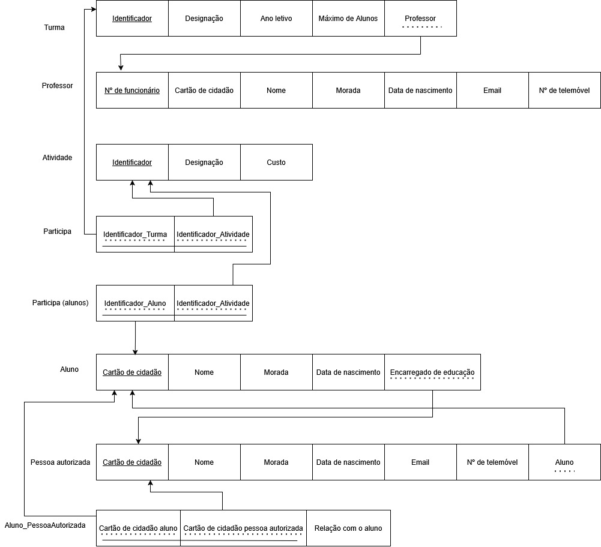

# BD: Guião 3

## ​Problema 3.1

### _a)_


<pre>
```
Tipo_veículo: <u>Código</u>, Designação, ArCondicionado

Similaridade: <span style="border-bottom: solid 1px; padding-bottom:1px;"><span style="text-decoration: underline dashed;">TipoVeiculo_Código1</span>, <span style="text-decoration: underline dashed;">TipoVeiculo_Código2</span></span>

Veículo: <u>Matrícula</u>, Marca, Ano, TipoVeiculo_código

Cliente: NIF, Nome, Endereço, Num_carta

Balcão: <u>Número</u>, Nome, Endereço

Aluguer: <u>Número</u>, Duração, Data, <span style="text-decoration: underline dashed;">Veículo_matrícula</span>, <span style="text-decoration: underline dashed;">Balcão_número</span>, <span style="text-decoration: underline dashed;">Cliente_NIF</span>

Ligeiro: <span style="text-decoration: underline dashed;">TipoVeiculo_Código</span>, Combustível, Portas, NumLugares

Pesado: <span style="text-decoration: underline dashed;">TipoVeiculo_Código</span>, Peso, Passageiros

```
</pre>

### _b)_

```
Chaves Primárias:
 -Aluguer -> Número
 -Balcão -> Número
 -Cliente -> NIF
 Veículo -> Matrícula
 -Tipo_veículo -> Código
 -Pesado -> Tipo
 -Ligeiro -> Tipo

Chaves Estrageiras:
 -Aluguer -> número(Balcão), NIF(Cliente), matrícula(Veículo)
 -Veículo -> codigo(Tipo_Veículo) 
 -Pesado -> codigo(Tipo_veículo) 
 -Ligeiro -> codigo(Tipo_Veículo) 
 -Similaridade -> código(Tipo_Veículo) 

Chaves Candidatas: 
 -Balcão -> nome 
 -Cliente -> num_carta
```

### _c)_



## ​Problema 3.2

### _a)_

<pre>
```
Flight: <u>Number</u>, Airline, WeekDays

Flightleg: <span style="border-bottom: solid 1px; padding-bottom:1px;"><span style="text-decoration: underline dotted;">Flight_Number</span>, <span style="text-decoration: underline dotted;"> Leg_Num</span></span>, Sch_Dep_Time, Sch_Arr_Time, <span style="text-decoration: underline dotted;">Dep_Airport_Code</span>, <span style="text-decoration: underline dotted;">Arr_Airport_Code</span>

LegInstance: <span style="border-bottom: solid 1px; padding-bottom:1px;"><span style="text-decoration: underline dotted;">FlightLeg_Flight_Number</span>, <span style="text-decoration: underline dotted;"> FlightLeg_LegNo</span>, <span style="text-decoration: underline dashed;"> Date </span></span>, Sch_Dep_Time, Sch_Arr_Time, <span style="text-decoration: underline dotted;">Airport_AirportDep_Code</span>, <span style="text-decoration: underline dotted;">Airport_AirportArr_Code</span>, <span style="text-decoration: underline dotted;">Airplane_AiplaneId</span>, NumAvailable_Seats

Seat: <span style="border-bottom: solid 1px; padding-bottom:1px;"><span style="text-decoration: underline dotted;">LegInstance_FlightLeg_Flight_Number</span>, <span style="text-decoration: underline dotted;">LegInstance_FlightLeg_LegNo</span>, <span style="text-decoration: underline dotted;">LegInstance_Date</span>, <span style="text-decoration: underline dotted;">SeatNum</span></span>, CustomerName, CPhone  

Airplane: <span style="border-bottom: solid 1px; padding-bottom:1px;">AiplaneId, <span style="text-decoration: underline dotted;">Type_Airplane_Type</span></span>, Total_NumSeats

AirplaneType: TypeName, MaxSeats, Company  

Airport: <u>Airport_Code</u>, City, State, Name  

CanLand: <span style="border-bottom: solid 1px; padding-bottom:1px;"><span style="text-decoration: underline dotted;">Airport_Airport_Code</span>, <span style="text-decoration: underline dotted;">AirplaneType_TypeName</span></span> 

Fare: <span style="border-bottom: solid 1px; padding-bottom:1px;"><span style="text-decoration: underline dotted;">Flight_Number</span>, <span style="text-decoration: underline dotted;">Code</span></span>, Amount, Restrictions
```
</pre>

### _b)_

```
Chaves Primarias:
 -Airport -> airport_code
 -Can_Land -> type_name(Airport), airport_code(Airplane_Type)
 -Airplane_Type -> type_name
 -Airplane -> airplane_id
 -Flight_leg -> Leg_number
 -Flight -> number
 -Fare -> code
 -Leg instance -> Date,Flight_number,leg_no
 -Seat -> Seat_number
 

Chaves Estrangeiras:
 -Airplane -> Airplane_Type
 -Can_Land -> type_name(Airport), airport_code(Airplane_Type)
 -Flight_leg -> number(Flight), leg_no(Flight Leg), airport_code(Departure Airport), airport_code(Arrival Airport)
 -Fare -> number(Flight)
 -Leg_instance -> airplane_id(Airplane), airport_code(Departure Airport), airport_code(Arrival Airport), leg no (Flight Leg)
 -Seat -> Date (Leg instance),Flight_number(Leg instance), leg_no(Leg instance)
 
 
Chaves Candidatas:
 -Airport -> name
 -Seat-> customer_name
```

### _c)_



## ​Problema 3.3

### _a)_ 2.1



### _b)_ 2.2



### _c)_ 2.3



### _d)_ 2.4


